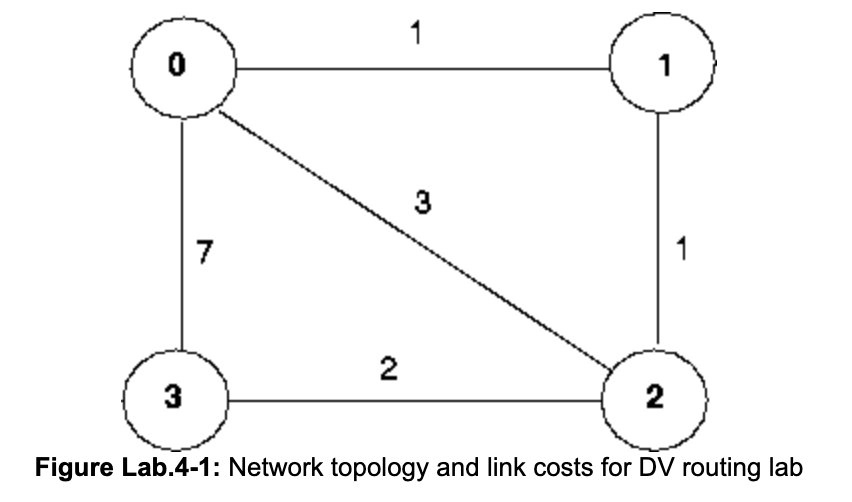
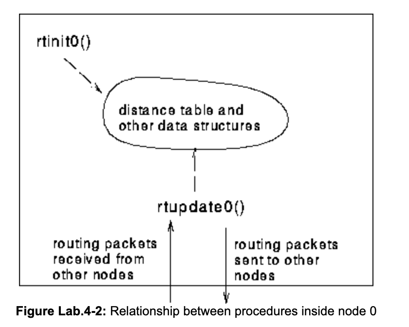

# 编程作业 6：实现算法  

## 概述

在本实验中，您将编写一组“分布式”程序，为图 Lab.4-1 所示的网络实现分布式异步距离矢量路由算法。
  

## 基本作业

您将编写的例程对于作业的基本部分，您将编写以下例程，这些例程将在我们为此作业编写的模拟环境中异步“执行”。

对于节点 0，您将编写例程：

rtinit0()该例程将在仿真开始时调用一次。rtinit0()没有参数。它应该初始化节点 0 中的距离表，以将 1、3 和 7 的直接成本分别反映到节点 1、2 和 3。在图 1 中，所有链路都是双向的，并且两个方向的成本相同。在初始化距离表和节点 0 例程所需的任何其他数据结构之后，它应该将其直接连接的邻居（在本例中为 1、2 和 3）发送到所有其他网络节点的最小成本路径成本. 通过调用例程tolayer2()，将此最小成本信息发送到路由数据包中的相邻节点，如下所述。路由数据包的格式也在下面描述。  
rtupdate0(struct rtpkt *rcvdpkt)。当节点 0 收到一个路由数据包时，该例程将被调用，该路由数据包是由其直接连接的邻居发送给它的。参数rcvdpkt是指向已接收数据包的指针。
rtupdate0()是距离向量算法的“心脏”。它在来自某个其他节点i的路由数据包中接收到的值包含 i到所有其他网络节点的当前最短路径成本。 rtupdate0()使用这些接收到的值来更新它自己的距离表（由距离向量算法指定）。如果更新导致它自己到另一个节点的最小成本发生变化，则节点 0 会通过向其直接连接的邻居发送路由数据包来将此最小成本变化通知给它们。回想一下，在距离矢量算法中，只有直接连接的节点才会交换路由数据包。因此，节点 1 和 2 将相互通信，但节点 1 和 3 将节点相互通信。

正如我们在课堂上看到的，每个节点内的距离表是距离向量算法使用的主要数据结构。您会发现将距离表声明为int的 4×4 数组很方便，其中节点 0 中距离表中的条目[i,j]是节点 0 当前计算的通过直接邻居 j 到节点 i 的成本. 如果 0 没有直接连接到 j，则可以忽略此条目。我们将使用整数值 999 为“无穷大”的约定。

节点 1、2、3 也定义了类似的例程。因此，您将总共编写 8 个过程：rtinit0()、rtinit1()、rtinit2()、rtinit3()、rtupdate0()、rtupdate1()、rtupdate2()、更新3()
  

## 软件接口

上述过程是您将要编写的过程。我们编写了以下可由您的例程调用的例程：

```c
tolayer2(struct rtpkt pkt2send)
where rtpkt is the following structure, which is already declared for you. The procedure tolayer2() is defined in the file prog3.c
extern struct rtpkt {
  int sourceid;  /* id of node sending this pkt, 0, 1, 2, or 3 */
  int destid;    /* id of router to which pkt being sent
                    (must be an immediate neighbor) */
  int mincost[4];    /* min cost to node 0 ... 3 */
  };
```

请注意，tolayer2()传递的是一个结构，而不是指向结构的指针。
打印数据0()
将漂亮地打印节点 0 的距离表。它被传递一个指向distance_table 类型结构的指针。 printdt0()和节点 0 距离表的结构声明在文件 node0.c 中声明。在文件node1.c、node2.c node3.c 中为您定义了类似的漂亮打印例程。

## 模拟网络环境

您的过程rtinit0()、rtinit1()、rtinit2()、rtinit3()和 rtupdate0()、rtupdate1()、rtupdate2()、rtupdate3()将路由数据包（其格式如上所述）发送到介质中。介质将按顺序传送数据包，并且不会丢失到指定的目的地。只有直接连接的节点才能通信。发送方和接收方之间的延迟是可变的（且未知）。

当您将您的程序和我的程序一起编译并运行生成的程序时，您将被要求仅指定一个关于模拟网络环境的值：

TRACK。将TRACK值设置为 1 或 2 将打印出有关仿真内部正在发生的事情的有用信息（例如，数据包和计时器正在发生什么）。TRACK值为 0 将关闭此功能。大于 2 的TRACK值将显示各种奇怪的消息，这些消息用于我自己的模拟器调试目的。
TRACK值 2 可能有助于您调试代码。你应该记住，真正的实现者没有底层网络来提供关于他们的数据包将要发生什么的如此好的信息！

## 基本作业

你要编写程序rtinit0()、rtinit1()、rtinit2()、rtinit3()和rtupdate0()、rtupdate1()、rtupdate2()、rtupdate3()， 它们一起将实现距离表的分布式异步计算对于图 1 所示的拓扑结构和成本。

您应该将节点 0 到 3 的过程放在名为 node0.c, .... node3.c 的文件中。您不允许声明任何在给定 C 文件外部可见的全局变量（例如，您在 node0.c中定义的任何全局变量只能在node0.c中访问）。这是为了强制您遵守您必须采用的编码约定，因为您实际上是在四个不同的节点中运行这些过程。要编译您的例程：cc prog3.c node0.c node1.c node2.c node3。  这些文件的原型版本在此处：node0.c、 node1.c、node2.c、 node3.c。您可以在以下位置获取文件 prog3.c 的副本http://gaia.cs.umass.edu/kurose/network/prog3.c。

此作业可以在任何支持 C 的机器上完成。它不使用 UNIX 功能。

一如既往，大多数讲师希望您提交代码清单、设计文档和示例输出。

对于示例输出，每当调用rtinit0()、rtinit1()、rtinit2()、rtinit3()或rtupdate0()、rtupdate1()、rtupdate2()、rtupdate3() 过程时，过程应打印出一条消息，给出时间（可通过我的全局变量clocktime获得）。对于rtupdate0(), rtupdate1(), rtupdate2(), rtupdate3()你应该打印传递给你例程的路由数据包发送者的身份，距离表是否更新，距离的内容表（您可以使用我的漂亮打印例程），以及由于任何距离表更新而发送到相邻节点的任何消息的描述。

示例输出应该是 TRACE 值为 2 的输出列表。突出显示每个节点中生成的最终距离表。您的程序将一直运行，直到网络中不再有路由数据包在传输，此时我们的模拟器将终止。

## 高级作业

您要编写两个过程，rtlinkhandler0(int linkid, int newcost)和rtlinkhandler1(int linkid, int newcost)，如果（以及何时）0 和 1 之间的链接成本发生变化，将调用它们。这些例程应分别在文件node0.c和node1.c中定义 。这些例程将传递成本已更改的链接另一侧的相邻节点的名称（id），以及链接的新成本。请注意，当链路成本发生变化时，这些例程将必须更新距离表，并且可能（或可能不会）将更新的路由数据包发送到相邻节点。

为了完成作业的高级部分，您需要将常量 LINKCHANGES（prog3.c 中的第 3 行）的值更改为 1。仅供参考，链接的成本将在时间 10000 时从 1 变为 20，并且然后在时间 20000 变回 1。您的例程将在这些时间被调用。

我们再次强烈建议您首先实施本科作业，然后扩展您的代码以实施研究生作业。这不会浪费时间。（相信我，这是我通过艰难的方式学到的！）

此作业的 JAVA 版本
上面的文档详细描述了该项目。在这里，我们提供了一个链接，指向在 JAVA 中执行分配所需的代码。确保你理解上面的材料。

[您需要的 JAVA 代码可以在此处找到](http://gaia.cs.umass.edu/cs453_fall_2010/hw_pa_labs/distance_vector_java_code)。

以下是您需要的各个文件：Entity.java、Entity0.java、Entity1.java、Entity2.java、Entity3.java、NetworkSimulator.java、Event.java、Packet.java、EventList.java、EventListImpl.java、项目.java

您将编写 Entity0.java、Entity1.java、Entity2.java 和 Entity3.java 的构造函数，它们类似于 C 版本中的 rtinit0()、rtinit1()、rtinit2() 和 rtinit3()。您还需要为 Entity0.java、Entity1.java、Entity2.java 和 Entity3.java 编写 update() 方法，它们类似于 C 版本中的 rtupdate0()、rtupdate1()、riupdate2() 和 rtupdate3() ./

请注意，Java 代码将允许您通过 NetworkSimulator 的 toLayer2() 方法发送不正确的数据包来挂起自己。所以请在那里格外小心。

## 问答

[当我们在介绍性网络课程中教授该实验室时，学生提出了各种问题。如果您有兴趣查看我们收到的问题（和答案），请查看](http://gaia.cs.umass.edu/kurose/network/programming_assignment_QA.html)